# Eclipse Embedded C/C++ Developer 설치 및 예제

## 1. GNU ARM Embedded Toolchain 설치
 

### 1. 아래의 링크에서 최신 버전의 GNUARMEmbeddedToolchain다운로드 (작성 시점에는 10.3-2021.10이 최신 버전)

https://developer.arm.com/downloads/-/gnu-rm

 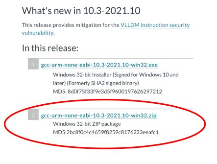

### 2. 압축 해제 후 C:\Apps디렉토리에 아래와 같이 복사

 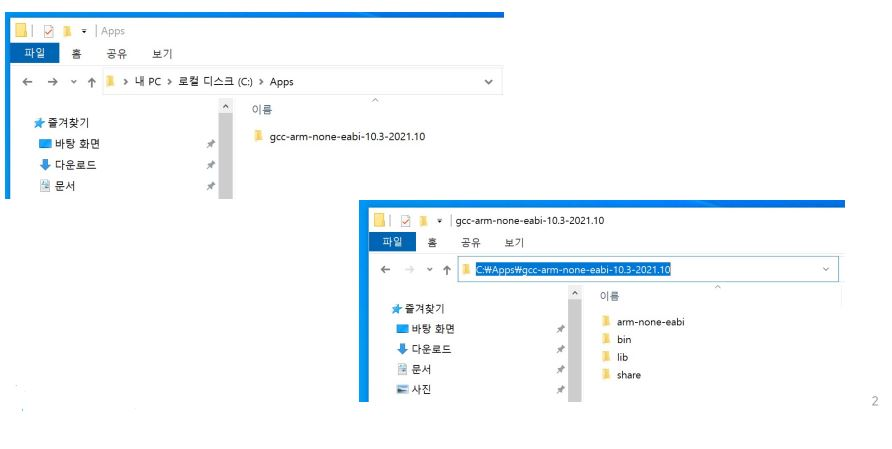

### 3. GNUARMEmbeddedToolchain의 경로를 설정하기 위해 시스템 속성의 ‘환경 변수’ 를 선택한다.

 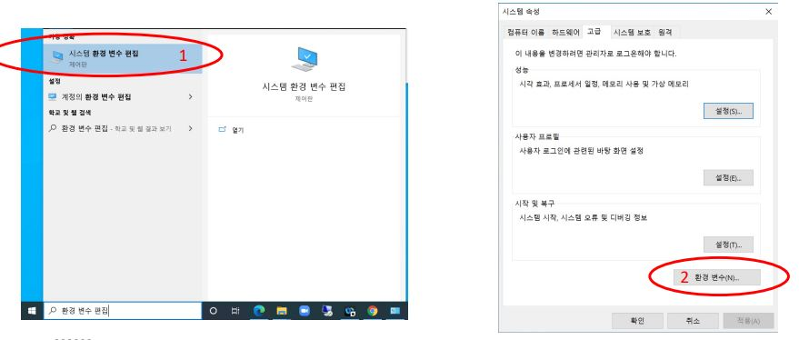

### 4. GNUARMEmbeddedToolchain의 경로를 설정하기 위해 시스템 속성의 ‘환경 변수’ 를 선택한다.

 

### 5. GNUARMEmbeddedToolchain의 경로를 확인하기 위해 검색창에 cmd를 입력하고 “명령 프롬프트”를 선택한다.

 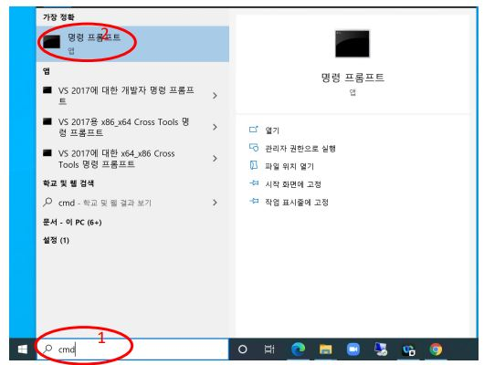

### 6. arm-none-eabi-gcc --version 명령어를 입력하여 툴체인의 정상 설치 확인

 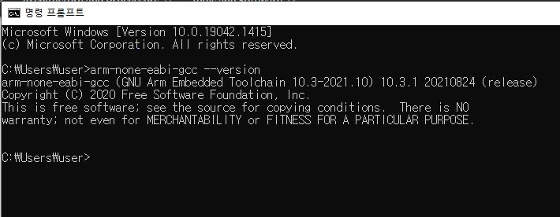

## 2. Eclipse 설치
 

### 1. http://eclipse.org/downloads 에서 Eclipseinstaller다운로드

 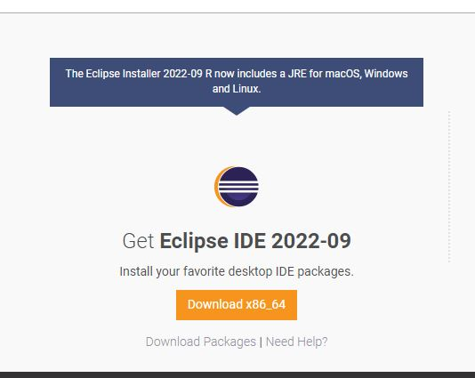

### 2. Eclipseinstaller를 실행하고 EclipseIDEforEmbedded C/C++Developers선택

 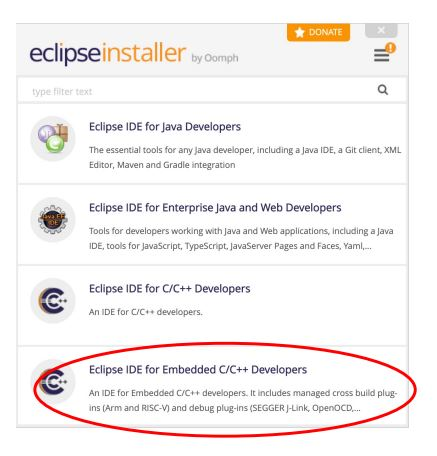

## 3. LED_ON 예제
 

### 1. Eclipse실행

* 설치한 경로에서 Eclipse를 실행

 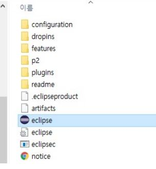

### 2. 프로젝트 생성

* File->new->C/C++Project를 실행

 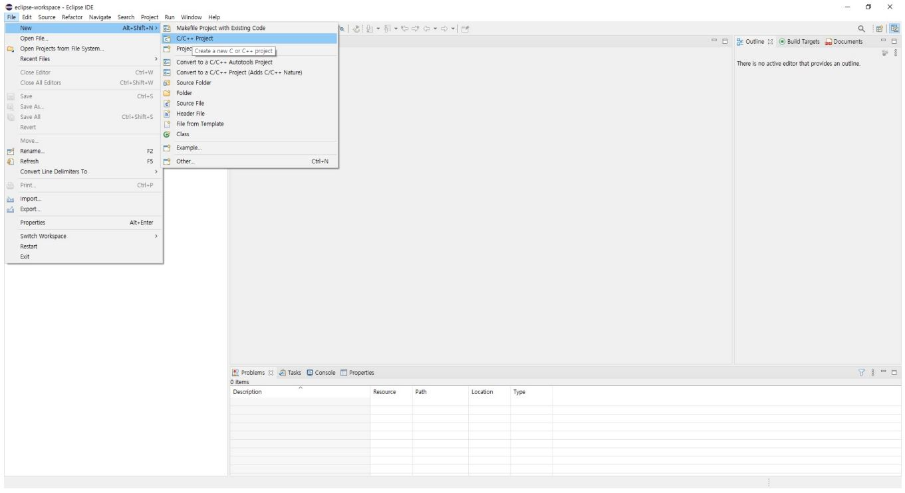

* C++ManagedBuild선택하고 Next

 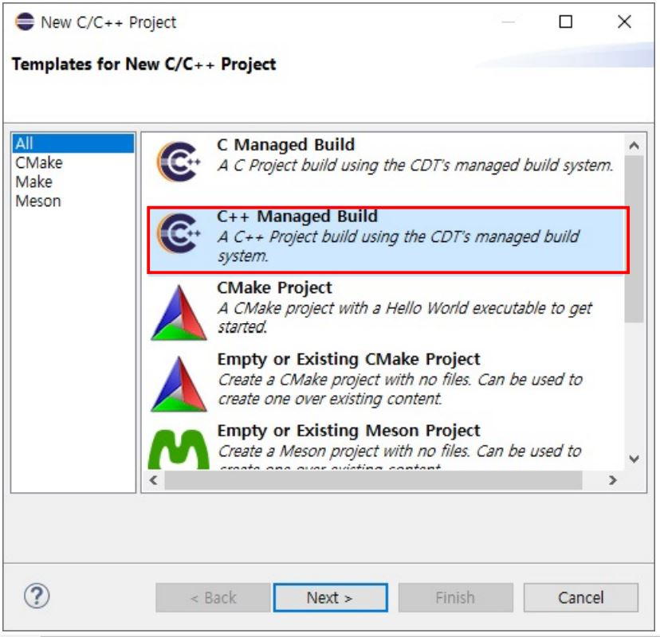

* 프로젝트 이름에 LED_EX를 입력
* Projecttype을 STM32F4xxC/C++Project로 선택
* Toolchains를 ArmCrossGCC로 선택

 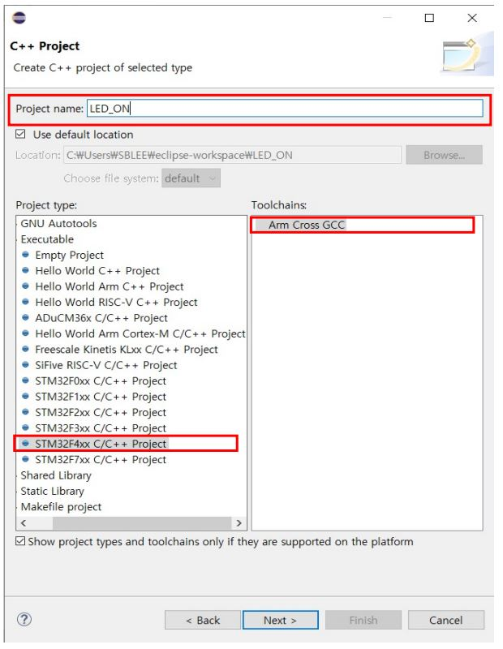

* Chipfamily: STM32F407xx
* Content : Empty
* Usesystemcalls:Semihosting

 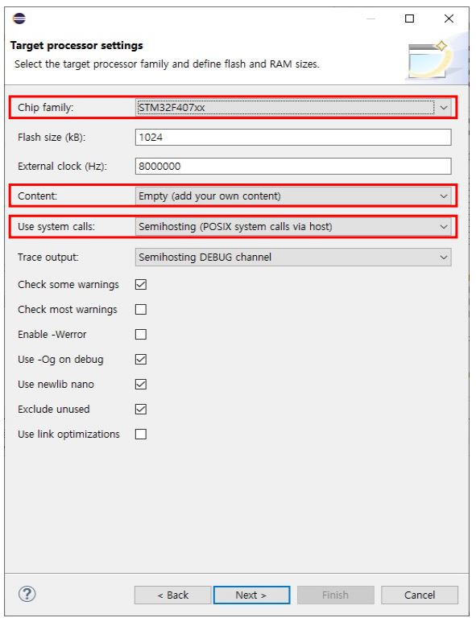

* 건드리지 않고 넘어간다.

 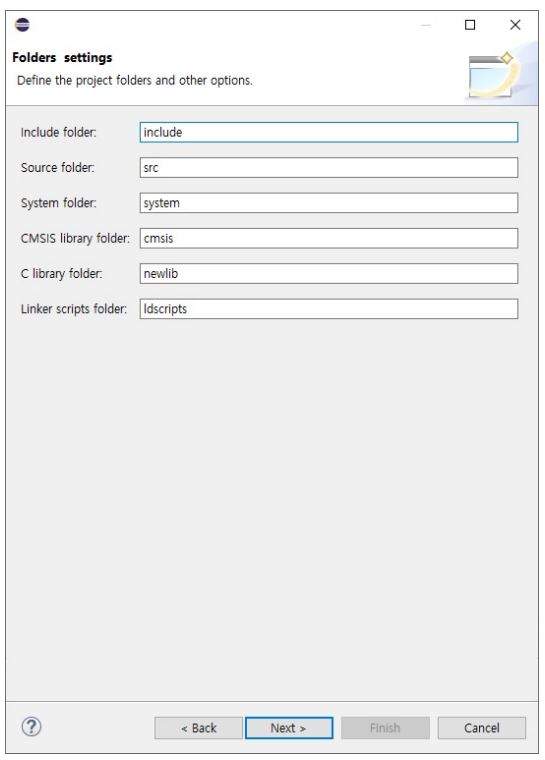

* Debug/Release를 모두 선택한다.

 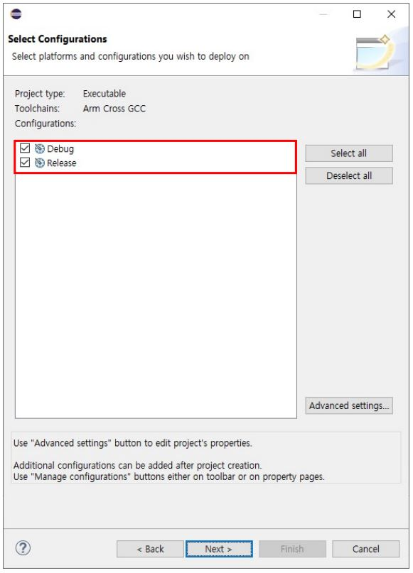

* 툴 체인 경로는 자동으로 등록됨
* 등록이 안된 경우 수동으로 등록할 툴 체인 경로
* C:\Users\AppData\Roaming\xPacks\@xpack-dev-tools\arm-none-eabi-gcc\10.2.1-1.1.2\.content\bin
* 만약 node/npm/xpm 이 설치되어 있지 않다면 위의 주소가 존재하지 않으므로 아래의 링크에서 설치
* https://eclipse-embed-cdt.github.io/plugins/prerequisites/#windows-build-tools

 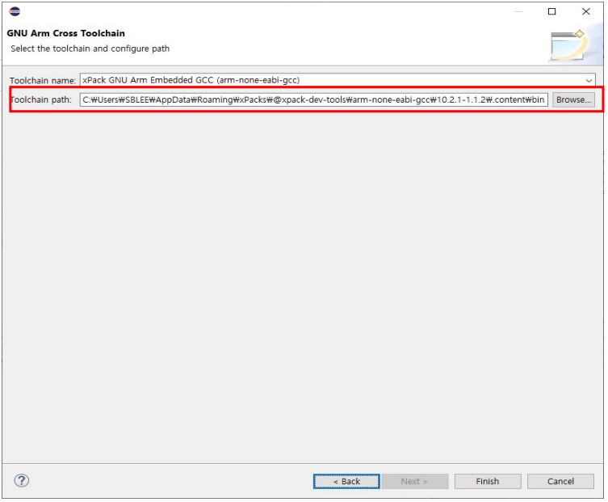

### 3. 소스코드(main.cpp) 작성

 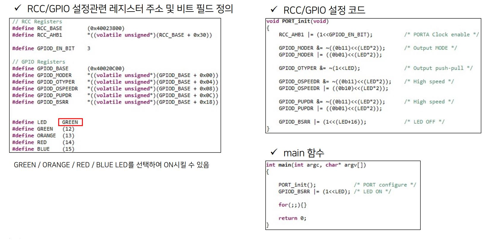

### 4. 프로젝트 빌드
망치 아이콘을 클릭하여 프로젝트를 빌드한다.
빌드가 완료되면 콘솔창을 통해 확인할 수 있다.
빌드의 결과물이 Debug폴더 아래에 생성된다.

 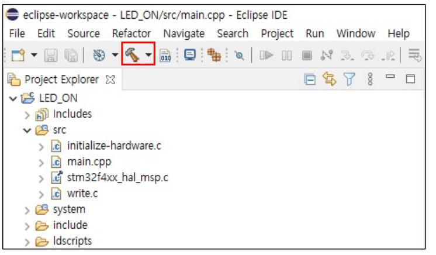

 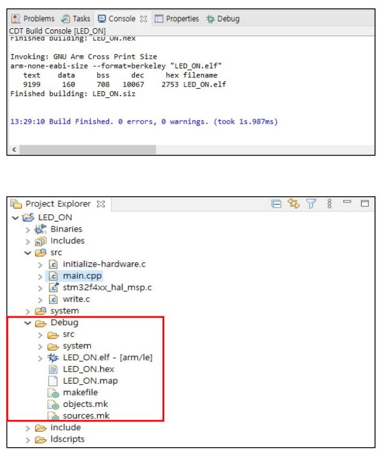

### 5. Boards/Devices 선택

* CMSISPACK을 클릭한다.
* CMSISPACK을 업데이트 한다.
* 오른쪽 아래와 같은 에러가 발생하면 IgnoreAll을 클릭한다.

 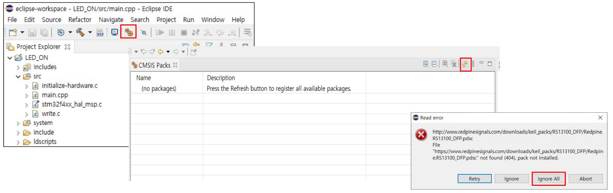

* 업데이트가 완료되면 install할 수 있는 Device/Board가 보이게 된다.
* Devices탭에서 STMicroelectonics 폴더 내 STM32F4Series를 클릭한다.
* STM32F4xx_DFP를 install한다.

 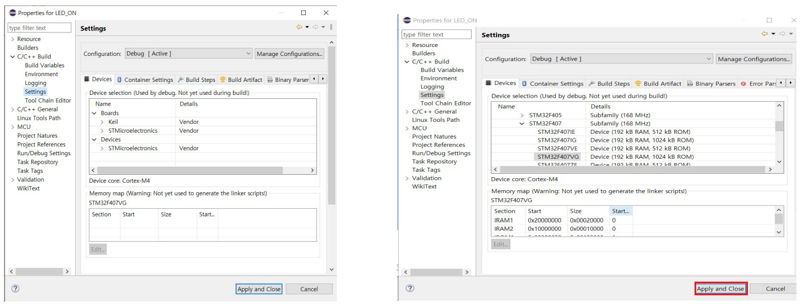

* 프로젝트 우 클릭 ->Properties->C/C++Build->Settings탭 선택
* Devices->STMicroelectronics->STM32F4Series->STM32F407->STM32F407VG선택

 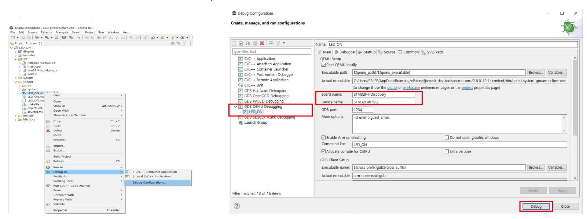

### 6. 디버깅

* LED_ON.elf 오른쪽으로 클릭 ->DebugAs-> DebugConfigurations.
* GDBQEMUDebugging더블 클릭
* Boardname:STM32F4-Discovery/Devicename:STM32F407VG이 입력되어 있지 않은 경우 입력
* Debug클릭

 

* 그래픽 윈도우가 생성된다.
* Run버튼을 누르면 동작이 수행된다.

 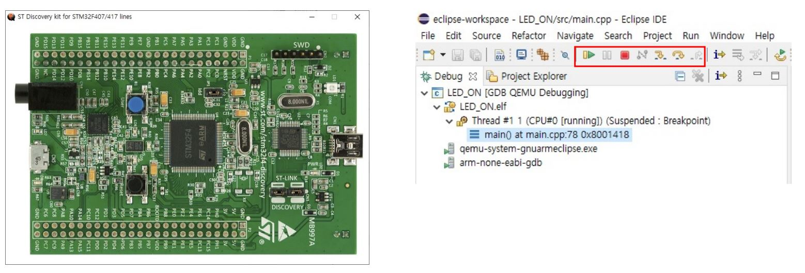

### 7. 실행결과 확인

* 초록 LED가 ON된 것을 확인할 수 있음

 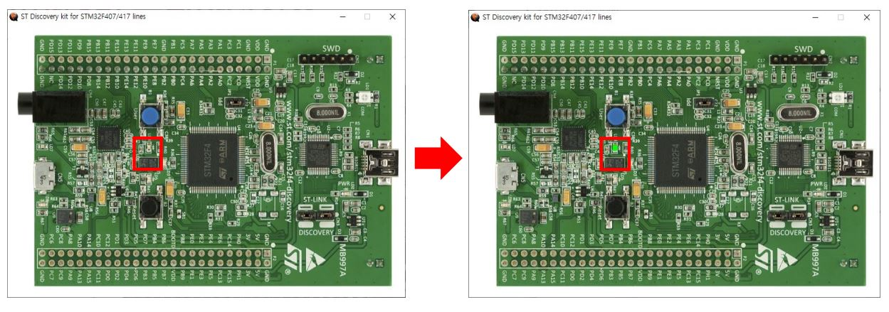

## 4. Hello_World 예제
 

### 1. LED_ON과 동일한 방식으로 hello_world 프로젝트를 생성

 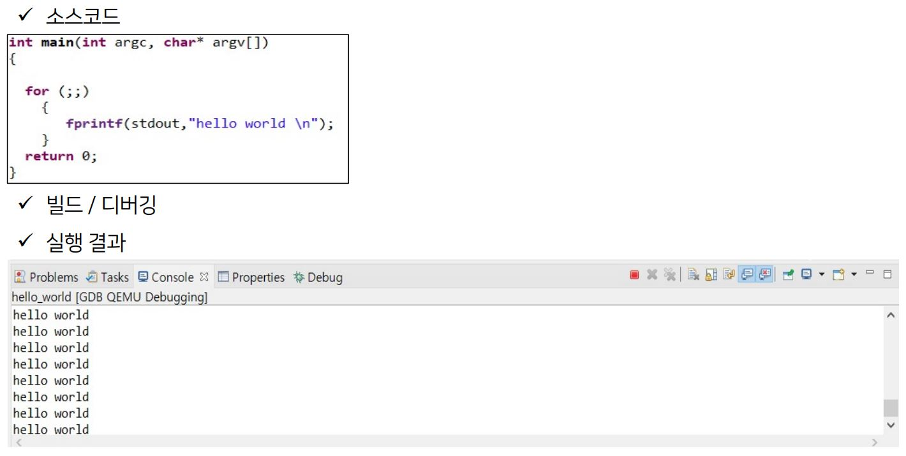

